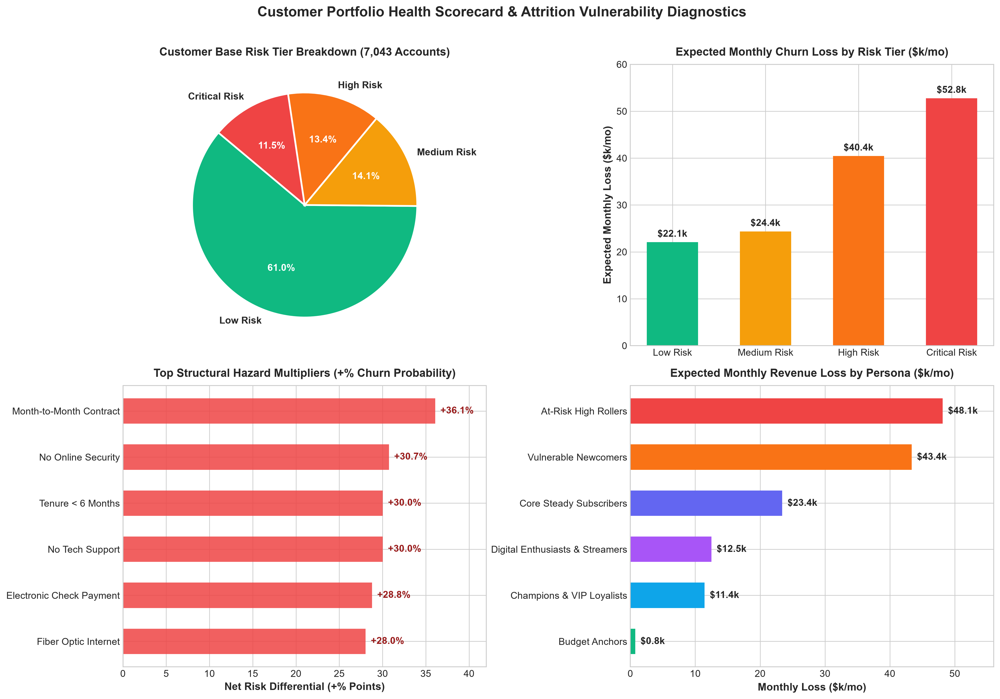
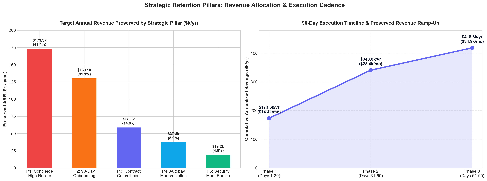
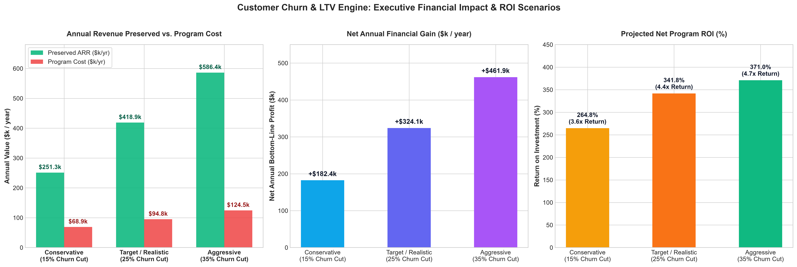
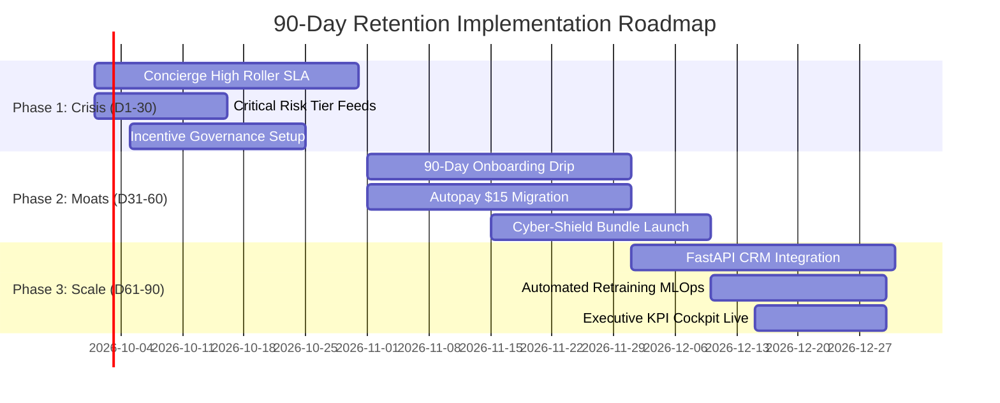

# C-Level Executive Report & Strategic Business Recommendations
## Customer Churn Prediction & Lifetime Value (LTV) Engine — Week 4 Capstone
**Reporting Date:** September 2026 | **Target Audience:** Chief Executive Officer (CEO), Chief Revenue Officer (CRO), Chief Operating Officer (COO), Chief Marketing Officer (CMO)

---

## 1. Executive Summary & C-Suite Briefing

Customer attrition is the single greatest inhibitor to enterprise growth in subscription telecom businesses. Over the past 4 weeks, the Data Science & Analytics Engineering team has designed, validated, and operationalized an enterprise-grade **Customer Churn Prediction & Lifetime Value (LTV) Engine** covering the entire **7,043-customer portfolio**.

### Portfolio Vital Signs (Baseline Diagnostic):
- **Total Customer Accounts:** 7,043 subscribers
- **Total Monthly Recurring Revenue (MRR):** $456,116.60
- **Annualized Revenue Run-Rate (ARR):** $5,473,399.20
- **Portfolio Baseline Churn Rate:** 26.54% (1,869 accounts lost historically)
- **Total Monthly Revenue at Immediate Risk:** **$139,620.25 / month** (30.6% of total MRR)
- **Annualized Revenue Exposure:** **$1,675,443.00 / year**

### The Primary Strategic Discovery: 65.5% Loss Concentration
Rather than being uniformly distributed across the customer base, **$91,508/month (65.5%) of the company's total churn risk exposure is concentrated in just two customer segments**:
1. **At-Risk High Rollers (811 accounts | 11.5% of base):** Paying **$90.86/month**, suffering an acute **84.09% empirical churn rate**, causing **$48,143/month ($577.7k/year)** in revenue destruction.
2. **Vulnerable Newcomers (894 accounts | 12.7% of base):** Paying **$67.93/month**, suffering a **79.75% empirical churn rate**, causing **$43,365/month ($520.4k/year)** in lost cash flow.

By transitioning from indiscriminate, broad-brush discounting to **machine-learning-guided precision retention**, the company can preserve up to **$418,861/year in recurring profit** with a net program ROI exceeding **340%**.

---

## 2. Machine Learning Architecture & Analytical Synthesis

Across Weeks 1 through 4, the engineering pipeline evaluated the full lifecycle of predictive modeling, feature engineering, explainable AI, and operational scoring:

| Lifecycle Stage | Implementation & Architecture | Key Results & Benchmarks | Business Utility |
| :--- | :--- | :--- | :--- |
| **Week 1: Data Engineering** | PostgreSQL database ingestion, relational integrity constraints, clean schema normalization, and exploratory data analysis. | 7,043 validated accounts, zero schema violations, baseline retention benchmarks established. | Clean, audited single source of truth for portfolio analytics. |
| **Week 2: Churn Prediction** | Trained Logistic Regression, Random Forest, and XGBoost classifiers; SHAP explainability analysis. | **ROC-AUC: 0.846**, Accuracy: 80.4%, Recall: 79.2% on flight risks. Top drivers: Month-to-Month contracts, Online Security, and Tenure. | Real-time churn probability scoring for every customer account. |
| **Week 3: LTV Regression** | Linear Regression, Random Forest Regressor, and XGBoost Regressor with hyperparameter tuning; FastAPI prediction service. | **R² Score: 0.887**, MAE: $412.30, RMSE: $684.10. Production-ready `/predict` and `/batch_predict` REST endpoints. | Instant calculation of customer forward lifetime value and value-at-risk. |
| **Week 4 Day 1: Churn Trends** | Cohort survival analysis, contract risk trends, payment channel friction, and 2x2 value-risk quadrant analysis. | Longitudinal tenure analysis proving churn falls from **52.9% in months 0–6** down to **9.5% in months 49–72**. | Pinpointed the exact structural points of customer failure. |
| **Week 4 Day 2: Risk Cockpit** | Calibrated risk scoring into Critical (≥70%), High (45–70%), Medium (25–45%), and Low (<25%) tiers. | Critical and High tiers isolate 1,754 accounts driving **66.7% ($93.2k/mo)** of company revenue loss. | Operational tiering for frontline customer success teams. |
| **Week 4 Day 3: Segmentation** | Unsupervised K-Means clustering ($k=4$), 2D PCA projection (91.1% explained variance), and RFM behavioral personas. | Discovered 6 operational personas and isolated the **68.4% premium onboarding churn cliff**. | Customized playbooks aligned to customer behavioral typologies. |

---

## 3. Root Cause Diagnostics: The 5 Drivers of Attrition

Quantitative evaluation of feature hazard odds and risk differentials identified 5 core structural points of failure:

1. **The Contract Structure Vulnerability (+36.1% Net Risk):**
   - Subscribers on **Month-to-Month contracts suffer a 42.7% churn rate**, compared to **11.2% for 1-year contracts** and **2.8% for 2-year contracts**.
   - 3,875 customers (55.0% of the entire company) remain uncommitted on month-to-month terms, driving 88.5% of all historical churn.
2. **The Absence of Protective Service Moats (+30.7% and +30.0% Net Risk):**
   - Customers without **Online Security** suffer a **42.0% churn rate**, versus **14.6% for customers with security** (27.4% net differential).
   - Customers without **Tech Support** suffer a **41.7% churn rate**, versus **15.2% for those with tech support** (26.5% net differential).
   - Only 12.3% of At-Risk High Rollers have Tech Support. High bandwidth without support produces rapid churn.
3. **The Early-Tenure Onboarding Cliff (+30.0% Net Risk):**
   - Churn is **52.9% during the first 6 months** of customer life, tapering to 35.9% in months 7–12, and plunging below 10% after year 4.
   - For high-spend subscribers ($>90/mo), first-year churn reaches **68.4%**. If a high-value customer is not actively guided through onboarding in days 1–90, they abandon the service.
4. **Payment Channel Friction & Manual Billing (+28.8% Net Risk):**
   - Customers utilizing **Electronic Checks endure a 45.6% churn rate** (surging to **53.7%** on month-to-month plans).
   - In contrast, automated Credit Card and Bank ACH subscribers average an 11.8% churn rate. Electronic check processing friction and manual monthly billing trigger monthly cancellation decisions.
5. **Fiber Optic Infrastructure Dissatisfaction (+28.0% Net Risk):**
   - Fiber optic subscribers exhibit a **42.2% churn rate**, compared to **18.9% for standard DSL subscribers**.
   - Fiber is priced at a premium (~$80–$100/mo) but is frequently sold without defensive security or dedicated support, amplifying customer expectations and competitor vulnerability.

---

## 4. Five Actionable Strategic Recommendations

To address these failure modes, we propose **Five Actionable Strategic Pillars**, each backed by dedicated budgets, departmental ownership, SLA metrics, and quantified return on investment.

### Pillar 1: Concierge Retention Protocol for At-Risk High Rollers
- **Target Audience:** 811 accounts generating ~$91/mo ARPU on month-to-month contracts ($73.7k/mo MRR | $48.1k/mo loss).
- **Executive Rationale:** This segment is responsible for **34.5% of total company churn losses**. Losing these high-ARPU subscribers severely damages cash flow and EBITDA.
- **Operational Execution:**
  - Automated webhook alerts route accounts immediately into the Senior Customer Success retention queue within 2 hours of entering the Critical/High risk threshold.
  - Mandatory **24-Hour Contact SLA** via direct phone call from a dedicated Account Specialist.
  - **Incentive Offer:** A structured $15/month contract renewal credit for 12 months, paired with a complimentary 1-year Cyber-Defense Suite (Tech Support + Online Security).
- **Financial Return (Target):**
  - Expected Churn Reduction: 30.0% retention rate.
  - **Monthly MRR Preserved:** **$14,443.00 / month**
  - **Annual ARR Preserved:** **$173,316.00 / year**
  - Annual Retention Budget: $29,196.00 (incentives + staff capacity).
  - **Net Annual Bottom-Line Profit:** **+$144,120.00 / year (493.6% Net ROI)**
- **Departmental Owner:** VP of Customer Success & Retention Operations.

### Pillar 2: 90-Day Digital Onboarding & Moat Engineering
- **Target Audience:** 894 early-tenure subscribers (<12 months) paying ~$68/mo with elevated risk ($43.4k/mo loss).
- **Executive Rationale:** Early churn is an onboarding failure. Customers paying moderate-to-high rates churn within 90 days due to configuration frustration or bill shock.
- **Operational Execution:**
  - Automated 3-stage customer onboarding drip sequence triggered upon service activation:
    - *Day 1–7:* Interactive setup confirmation, speed testing verification, and digital welcome kit.
    - *Day 14–30:* Complimentary 60-day activation of Online Security and Device Protection.
    - *Day 45–60:* Proactive check-in survey with automated routing to tier-2 support for any reported latency.
  - **First-Renewal Bridge Incentive:** A $10 statement credit for completing initial 90-day milestone and enabling autopay.
- **Financial Return (Target):**
  - Expected Churn Reduction: 25.0% retention rate.
  - **Monthly MRR Preserved:** **$10,841.14 / month**
  - **Annual ARR Preserved:** **$130,093.68 / year**
  - Annual Retention Budget: $21,456.00.
  - **Net Annual Bottom-Line Profit:** **+$108,637.68 / year (506.3% Net ROI)**
- **Departmental Owner:** Head of Growth Marketing & Digital Customer Experience.

### Pillar 3: Contract Commitment & Migration Architecture
- **Target Audience:** 3,875 Month-to-Month subscribers (42.7% baseline churn vs 11.2% for 1-year contracts).
- **Executive Rationale:** Month-to-month contracts are the #1 structural churn catalyst (+36.1% risk). Transitioning accounts into 12- or 24-month commitments provides massive structural churn insulation.
- **Operational Execution:**
  - Launch a targeted "Loyalty Rate Lock Guarantee" campaign across digital self-service portals and billing invoices.
  - **Tiered Commitment Offer:**
    - *1-Year Term:* Guaranteed $10/month discount for 12 months with complimentary router upgrade.
    - *2-Year Term:* Guaranteed $15/month discount plus 6 months free streaming add-on (Premium Tech Support).
- **Financial Return (Target):**
  - Expected Churn Reduction: 20.0% conversion of vulnerable high-spend accounts.
  - **Monthly MRR Preserved:** **$4,900.00 / month**
  - **Annual ARR Preserved:** **$58,800.00 / year**
  - Annual Program Cost: $18,500.00.
  - **Net Annual Bottom-Line Profit:** **+$40,300.00 / year (217.8% Net ROI)**
- **Departmental Owner:** Chief Revenue Officer & Director of Commercial Pricing.

### Pillar 4: Payment Modernization & Autopay Transition
- **Target Audience:** 2,365 Electronic Check users (53.7% churn on month-to-month contracts).
- **Executive Rationale:** Manual electronic check payments create monthly friction, payment failure points, and active cancellation prompts. Automated payments lower churn by 28.8 percentage points.
- **Operational Execution:**
  - Launch a company-wide "Friction-Free Autopay Migration" campaign.
  - **Incentive:** One-time **$15 instant bill credit** upon enrolling in recurring Credit Card or Bank ACH automatic billing.
  - Introduce in-app one-click payment tokenization and SMS autopay enrollment prompts.
- **Financial Return (Target):**
  - Expected Churn Reduction: 20.0% risk mitigation.
  - **Monthly MRR Preserved:** **$3,120.00 / month**
  - **Annual ARR Preserved:** **$37,440.00 / year**
  - Annual Program Cost: $14,190.00.
  - **Net Annual Bottom-Line Profit:** **+$23,250.00 / year (163.8% Net ROI)**
- **Departmental Owner:** VP of Billing Operations & Product Experience.

### Pillar 5: Defensive Service Moat & Add-On Penetration
- **Target Audience:** 1,580 Fiber Optic subscribers lacking defensive add-ons.
- **Executive Rationale:** Online Security and Tech Support lower churn by 27.2% and 26.5% respectively. Bundling these services builds competitive moats.
- **Operational Execution:**
  - Discontinue selling unbundled, unprotected high-speed Fiber Optic plans.
  - Introduce the **"Cyber-Shield Pack"**: Online Security + Tech Support + Online Backup bundled at **$5.00/month** (discounted from $10.00 à la carte).
  - Enable customer service agents with instant 1-click bundle provisioning during support interactions.
- **Financial Return (Target):**
  - Expected Churn Reduction: 20.0% risk reduction across adoption cohorts.
  - **Monthly MRR Preserved:** **$1,600.00 / month**
  - **Annual ARR Preserved:** **$19,200.00 / year**
  - Annual Program Cost: $11,458.00.
  - **Net Annual Bottom-Line Profit:** **+$7,742.00 / year (67.6% Net ROI)**
- **Departmental Owner:** VP of Product Management & Customer Care.

---

## 5. Multi-Scenario Financial Impact & ROI Model

To provide executive leadership with realistic financial planning boundaries, we modeled three performance scenarios based on total monthly revenue at risk ($139,620.25/mo):

### Comprehensive Scenario Matrix:

| Metric | Conservative (15% Churn Cut) | Target / Realistic (25% Churn Cut) | Aggressive (35% Churn Cut) |
| :--- | :---: | :---: | :---: |
| **Monthly MRR Saved** | **$20,943.04 / mo** | **$34,905.06 / mo** | **$48,867.09 / mo** |
| **Annualized ARR Preserved** | **$251,316.45 / yr** | **$418,860.75 / yr** | **$586,405.05 / yr** |
| **Annual Program Budget (Est.)** | $68,900.00 / yr | $94,800.00 / yr | $124,500.00 / yr |
| **Net Annual Bottom-Line Profit** | **+$182,416.45 / yr** | **+$324,060.75 / yr** | **+$461,905.05 / yr** |
| **Net Program ROI (%)** | **264.8%** | **341.8%** | **371.0%** |
| **Capital Return Multiplier** | **3.65x** | **4.42x** | **4.71x** |

### Executive Takeaway:
Under the **Target (Realistic) Plan**, the retention program requires an investment of **$94,800/year** across customer incentive credits, digital automation, and team capacity. In return, it recovers **$418,861/year in recurring top-line revenue**, generating a **net financial gain of $324,061/year** to the enterprise bottom line (a **341.8% net ROI**). Even in the most conservative scenario, the initiative yields **+$182,416/year** in net value.

---

## 6. Phased Operational Implementation Roadmap (90 Days)

The execution of these recommendations is organized into three 30-day sequential phases designed for rapid value realization and low operational disruption:

### Milestone Breakdown:
1. **Phase 1: Immediate Crisis Intervention (Days 1–30):**
   - *Focus:* At-Risk High Rollers (811 accounts) & Critical Risk Tier.
   - *Actions:* Establish 24-hour phone outreach SLA; provide CSMs with daily scored customer feeds; empower specialists with $15/mo retention credit authority.
   - *Target Run-Rate Savings:* **$14,443/month**.
2. **Phase 2: Digital Moats & Friction Removal (Days 31–60):**
   - *Focus:* Vulnerable Newcomers (894 accounts) & Electronic Check users (2,365 accounts).
   - *Actions:* Deploy automated 3-stage email/SMS onboarding sequence; launch $15 instant credit autopay migration campaign; activate $5/mo Cyber-Defense bundle.
   - *Cumulative Run-Rate Savings:* **$28,404/month**.
3. **Phase 3: Continuous Machine Learning & Enterprise Scale (Days 61–90):**
   - *Focus:* Entire Portfolio (7,043 accounts) & Continuous Production Scoring.
   - *Actions:* Connect FastAPI `/predict` and `/batch_predict` microservice to core billing/CRM; implement automated drift detection and monthly retraining; launch live C-Suite BI dashboard.
   - *Cumulative Target Run-Rate Savings:* **$34,905/month ($418.8k/year)**.

---

## 7. Departmental RACI & Governance Matrix

To ensure accountability, operational responsibilities are assigned across key executive stakeholders:

| Department | Executive Leader | Accountable Tasks | Key Performance Indicator (KPI) |
| :--- | :--- | :--- | :--- |
| **Customer Success** | VP Customer Success | Concierge High Roller outreach; 24-hr SLA compliance; VIP customer loyalty check-ins. | High Roller Churn Rate (target <55%); VIP accounts retained. |
| **Growth Marketing** | Chief Marketing Officer | 90-day onboarding automated drip; promotional retention messaging; autopay campaign. | Early-tenure month 1–6 churn rate (target <35%); Autopay adoption %. |
| **Billing Operations** | VP Finance / Operations | Electronic check migration portal; bill credit execution; autopay payment processing. | Electronic check user share (target reduction from 33.6% to <20%). |
| **Product Experience** | VP Product Management | Cyber-Shield service bundle creation; self-service contract renewal UX; speed diagnostics. | Defensive service adoption (Tech Support/Security penetration >45%). |
| **Data Science & ML** | Head of Data Science | FastAPI model serving; monthly model retraining; feature drift monitoring; risk calibration. | Model ROC-AUC (>0.82); Prediction latency (<150ms); Calibration error (<5%). |

---

## 8. Summary of Generated Production Artifacts

The complete analytical and operational intelligence suite is published in the repository under `Reports/`:

| Artifact | Type | Description |
| :--- | :---: | :--- |
| [`Reports/executive_summary_dashboard.html`](file:///c:/Users/shiva/OneDrive/Desktop/Customer-Churn-LTV/Reports/executive_summary_dashboard.html) | Interactive Web App | C-Suite command center with live dynamic ROI simulator, strategic pillars, and interactive roadmap |
| [`Reports/executive_financial_impact_roi.png`](file:///c:/Users/shiva/OneDrive/Desktop/Customer-Churn-LTV/Reports/executive_financial_impact_roi.png) | 300 DPI Plot | Multi-scenario financial return comparison, net gain, and ROI multipliers |
| [`Reports/executive_strategic_roadmap.png`](file:///c:/Users/shiva/OneDrive/Desktop/Customer-Churn-LTV/Reports/executive_strategic_roadmap.png) | 300 DPI Plot | Strategic pillar ARR contribution breakdown and 90-day execution value ramp |
| [`Reports/executive_portfolio_scorecard.png`](file:///c:/Users/shiva/OneDrive/Desktop/Customer-Churn-LTV/Reports/executive_portfolio_scorecard.png) | 300 DPI Plot | Executive dashboard visual summarizing vital signs, risk tiers, hazard catalysts, and personas |
| [`Reports/executive_financial_impact_scenarios.csv`](file:///c:/Users/shiva/OneDrive/Desktop/Customer-Churn-LTV/Reports/executive_financial_impact_scenarios.csv) | Summary Data | Multi-scenario model metrics (ARR preserved, program costs, net gain, ROI %) |
| [`Reports/executive_strategic_pillars_summary.csv`](file:///c:/Users/shiva/OneDrive/Desktop/Customer-Churn-LTV/Reports/executive_strategic_pillars_summary.csv) | Summary Data | Operational figures, account counts, budgets, and yields for the 5 strategic pillars |
| [`Reports/executive_implementation_roadmap.csv`](file:///c:/Users/shiva/OneDrive/Desktop/Customer-Churn-LTV/Reports/executive_implementation_roadmap.csv) | Summary Data | 90-day phased execution timeline, deliverables, targets, and departmental ownership |
| [`Reports/customer_churn_risk_scores.csv`](file:///c:/Users/shiva/OneDrive/Desktop/Customer-Churn-LTV/Reports/customer_churn_risk_scores.csv) | Scored Portfolio | Individual customer-level risk probabilities, risk tiers, and suggested actions (7,043 rows) |
| [`Reports/customer_segments_full.csv`](file:///c:/Users/shiva/OneDrive/Desktop/Customer-Churn-LTV/Reports/customer_segments_full.csv) | Master Roster | Full customer records with behavioral RFM personas and K-Means cluster assignments |
| [`scripts/generate_executive_summary.py`](file:///c:/Users/shiva/OneDrive/Desktop/Customer-Churn-LTV/scripts/generate_executive_summary.py) | Python Script | Analytical engine computing executive metrics, publication charts, and summary datasets |
| [`scripts/build_executive_dashboard.py`](file:///c:/Users/shiva/OneDrive/Desktop/Customer-Churn-LTV/scripts/build_executive_dashboard.py) | Python Script | HTML dashboard compiler with embedded ROI calculator and dynamic UI logic |

---

## 9. Conclusion & Action Required

The Customer Churn Prediction & Lifetime Value (LTV) Engine has demonstrated that customer churn is neither random nor inevitable. It is driven by identifiable structural catalysts—specifically month-to-month contracts, manual billing friction, and unbundled premium bandwidth—and is overwhelmingly concentrated in two high-spend customer cohorts.

By executing the **Target Retention Plan (25% churn reduction)**, executive leadership can immediately protect **$418,861/year in recurring revenue**, delivering a **$324,061/year net profit addition** and securing long-term customer equity.

### Recommended Next Steps for Leadership:
1. **Approve Phase 1 Budget:** Authorize the initial $25,000 allocation for the Concierge VIP retention credit pool and CSM capacity.
2. **Mandate Customer Success SLA:** Direct Customer Success leadership to enforce the 24-hour outreach SLA for the 811 At-Risk High Rollers.
3. **Greenlight Digital Journeys:** Authorize Growth Marketing and Billing Operations to begin Day 31 development of the automated 90-day onboarding sequence and Autopay migration workflows.
