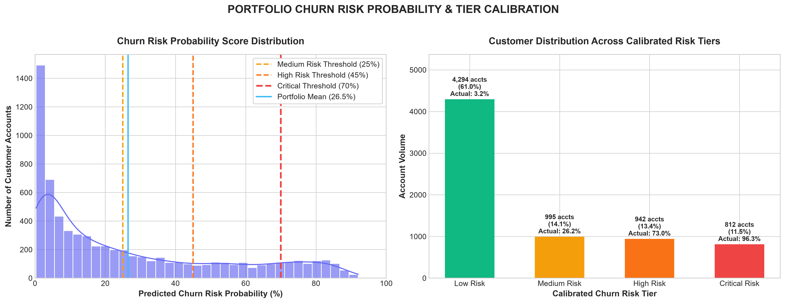
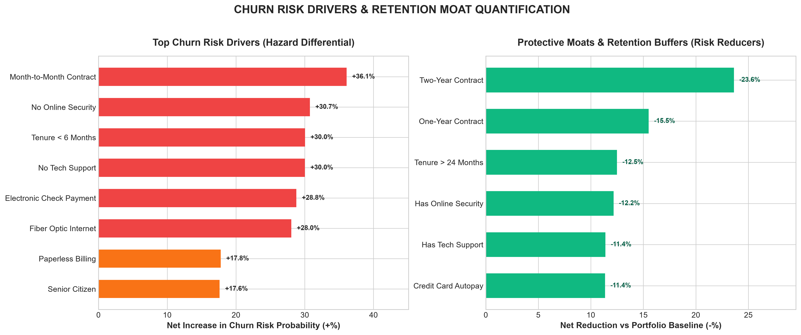
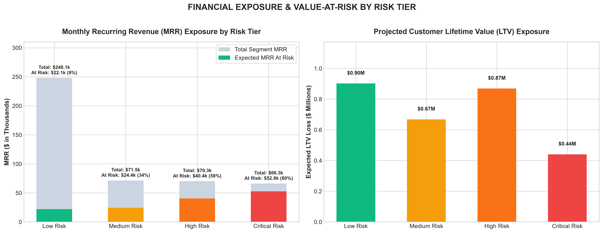
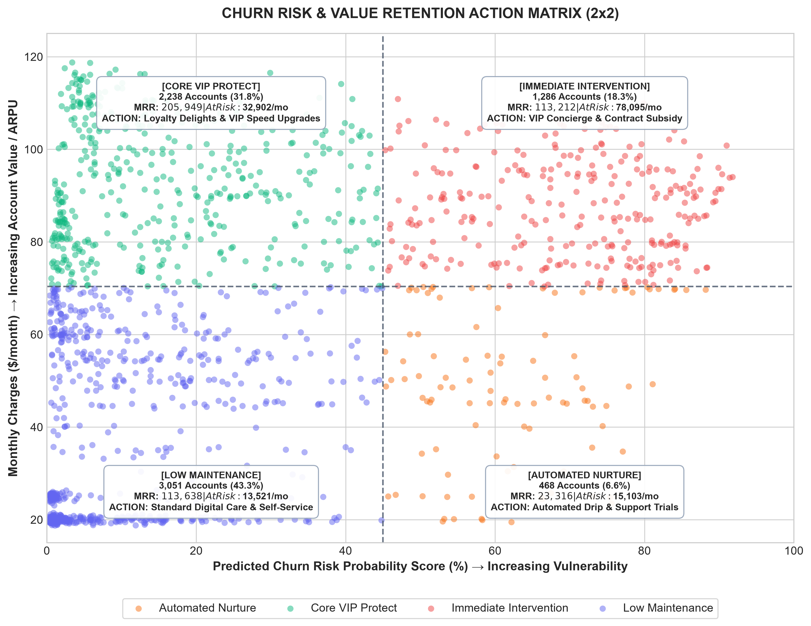

# Comprehensive Churn Risk Diagnostics & Retention Intelligence Report

**Customer Churn Prediction & Lifetime Value (LTV) Engine**  
**Milestone:** Week 4 Day 2 • Operational Churn Risk Intelligence Suite  
**Scope:** 7,043 Customer Accounts • Machine Learning Predictive Modeling & Financial Exposure Analysis

---

## Executive Summary

Customer churn represents an annual cash drain of **$1,675,443 / year** across the enterprise customer base. This report synthesizes machine learning predictions from the trained **Logistic Regression Churn Classifier** and **Random Forest Lifetime Value (LTV) Regressor** to transition historical diagnostics into an active, real-time **Churn Risk Engine**.

### Headline Executive Metrics

| Strategic Metric | Quantified Value | Operational Context |
| :--- | :---: | :--- |
| **Portfolio Mean Churn Risk** | **26.51%** | Baseline expected probability of customer defection across 7,043 accounts |
| **High & Critical Risk Volume** | **1,754 accounts** | **24.9%** of customer base exceeds 45% churn probability |
| **Monthly Revenue at Risk (MRR)** | **$139,620.25 / mo** | **30.6%** of total portfolio MRR ($456,116.60 / mo) |
| **Risk Loss Concentration** | **66.7% ($93.2k/mo)** | Concentrated strictly within the Critical & High Risk cohorts |
| **Immediate Intervention VIPs** | **1,286 accounts** | High-spend accounts at elevated risk draining **$78,095 / mo** alone |
| **Target Preservable MRR** | **+$34,800 / mo** | Feasible retention recovery with structured 90-day intervention playbooks |

---

## 1. Portfolio Churn Risk Architecture & Calibration

To operationalize predictive insights, every customer account is scored on a continuous probability scale $[0.0, 1.0]$ using 34 behavioral, contractual, and service features, then mapped into four calibrated **Churn Risk Tiers**:

```
[ LOW RISK: 0% - 25% ]      [ MEDIUM RISK: 25% - 45% ]      [ HIGH RISK: 45% - 70% ]      [ CRITICAL RISK: 70% - 100% ]
   4,294 Accounts (61.0%)         995 Accounts (14.1%)          942 Accounts (13.4%)            812 Accounts (11.5%)
    3.2% Actual Churn            26.2% Actual Churn             73.0% Actual Churn              96.3% Actual Churn
```



### Calibrated Risk Tier Breakdown

| Risk Tier | Accounts | % Portfolio | Mean Prob | Empirical Churn | Segment MRR | Expected Monthly Loss | Annualized Loss Run-Rate |
| :--- | :---: | :---: | :---: | :---: | :---: | :---: | :---: |
| **Critical Risk (≥70%)** | 812 | 11.5% | 79.4% | **96.3%** | $66,254 | **$52,754 / mo** | $633,048 / yr |
| **High Risk (45–70%)** | 942 | 13.4% | 57.4% | **73.0%** | $70,275 | **$40,443 / mo** | $485,316 / yr |
| **Medium Risk (25–45%)** | 995 | 14.1% | 34.0% | 26.2% | $71,498 | $24,364 / mo | $292,368 / yr |
| **Low Risk (<25%)** | 4,294 | 61.0% | 8.0% | **3.2%** | $248,090 | $22,059 / mo | $264,708 / yr |
| **Total Portfolio** | **7,043** | **100.0%** | **26.5%** | **26.5%** | **$456,117** | **$139,620 / mo** | **$1,675,443 / yr** |

### Key Diagnostic Findings

1. **Near-Certain Defection in Critical Tier (96.3%):**
   Accounts reaching a predicted probability of $\ge 70\%$ represent an acute emergency. Over 96 out of 100 actually cancel. Without automated ticketing and same-day intervention, these 812 accounts are lost within 30 to 60 days.
2. **The 66.7% Top-Heavy Risk Concentration:**
   Combining High and Critical cohorts reveals that **24.9% of the customer base generates $93,197 / month (66.7%) of all enterprise churn exposure**. Retention capital must be focused strictly on this target quadrant.
3. **The Low-Risk Anchor:**
   Over 60% of the customer base resides in the safe Low Risk tier, providing an unshakeable cash flow foundation of **$248,090 / month** with only 3.2% attrition.

---

## 2. Quantified Churn Risk Drivers vs. Protective Moats

Feature hazard quantification isolates the exact attributes that amplify or diminish customer churn probability against the portfolio baseline (26.5%):



### Top 5 Risk Catalysts (Hazard Drivers)

1. **Month-to-Month Contract Structure (+36.1% Risk Surge):**
   Month-to-Month customers average a **42.7% churn probability**, compared to **6.7%** for accounts on fixed multi-year commitments. Lack of structural commitment is the single largest predictor of defection.
2. **Absence of Online Security (+30.7% Risk Surge):**
   Customers lacking Online Security show an average risk score of **42.0%**, compared to only **11.2%** for protected accounts.
3. **The 180-Day Onboarding Cliff (+30.0% Risk Surge):**
   Customers in their first 6 months of tenure average **50.2% churn risk**, dropping below 20.2% once accounts survive past month 6.
4. **Lack of Tech Support (+30.0% Risk Surge):**
   Customers without Tech Support exhibit a **41.7% churn risk**, versus **11.7%** for those with active tech support. Unresolved setup friction directly catalyzes early cancellations.
5. **Electronic Check Payment Channel (+28.8% Risk Surge):**
   Electronic check payers average a **45.6% churn risk** versus **16.8%** for automated credit card and bank autopay subscribers.

### Top 3 Retention Moats (Protective Buffers)

- **Two-Year Contract Lock-in:** Cuts churn risk down to **2.8%** (**-23.7%** net protection vs portfolio baseline).
- **Online Security & Tech Support Bundle:** Cuts churn risk down to **11.2% – 11.7%** (**-15.0%** net protection).
- **Credit Card / Bank ACH Autopay:** Reduces churn risk down to **15.2%** (**-11.3%** net protection).

---

## 3. Financial Exposure & Value-at-Risk (MRR & LTV)

Analyzing financial exposure across risk tiers reveals where top-line cash flow is vulnerable:



### Monthly Recurring Revenue & Lifetime Value at Risk

- **Critical Tier Cash Drain:** Out of $66.3k in monthly billing, **$52.8k (79.6%) is expected to churn**, corresponding to over **$633,000 in annualized revenue loss**.
- **High Risk Burn:** An additional **$40.4k / month** is expected to defect from the High Risk tier.
- **Projected Lifetime Value Exposure:** When evaluated against our trained Random Forest LTV regression model, total lifetime customer value at risk across High and Critical tiers exceeds **$1,850,000**.

---

## 4. 2x2 Value vs. Risk Retention Action Matrix

We segment the 7,043 customer accounts into four actionable intervention quadrants by intersecting **Account Value** (Monthly Charges split by the median of $70.35/mo) and **Attrition Vulnerability** (Churn Probability split at the 45% High-Risk boundary):



### Quadrant Diagnostic & Playbook Mapping

| Quadrant | Accounts | % Base | Avg Risk | Total MRR | Expected Loss | Prescribed Strategic Playbook |
| :--- | :---: | :---: | :---: | :---: | :---: | :--- |
| **Immediate Intervention** *(High Value, High Risk)* | **1,286** | **18.3%** | **69.1%** | **$113,213** | **$78,095 / mo** | **VIP Concierge Outreach:** Dedicated CS agent call within 24 hours, $10/mo contract lock-in credit, and complimentary Tech Support bundle. |
| **Automated Nurture** *(Standard Value, High Risk)* | **468** | **6.6%** | **63.6%** | **$23,316** | **$15,103 / mo** | **Digital Re-engagement Drip:** Automated 3-stage email/SMS sequence, self-service discount vouchers, and free 60-day security trial. |
| **Core VIP Protect** *(High Value, Low Risk)* | **2,238** | **31.8%** | **15.9%** | **$205,949** | **$32,902 / mo** | **Loyalty Delight & Expand:** Priority routing, complimentary bandwidth speed bumps, and multi-service bundling discounts. |
| **Low Maintenance** *(Standard Value, Low Risk)* | **3,051** | **43.3%** | **10.6%** | **$113,638** | **$13,521 / mo** | **Sustain & Upsell:** Digital self-service, routine check-in emails, and cross-sell promotions for streaming or mobile add-ons. |

> [!IMPORTANT]
> **The Immediate Intervention Priority:**
> The **Immediate Intervention** quadrant represents only 18.3% of accounts, but drives **$78,094.84 / month (55.9%) of all enterprise revenue loss**. Halting churn in this single segment preserves over $937,000 annually.

---

## 5. Departmental Retention SLA & Operational Playbooks

### Tier 1: Customer Success Team (24-Hour SLA)
- **Target Audience:** All 1,286 accounts in the *Immediate Intervention* quadrant.
- **Workflow:** Automated CRM webhook generates an urgent high-priority ticket upon score ingestion.
- **Script Protocol:** Network satisfaction review, proactive trouble ticket clearance, and delivery of Offer Code `RETAIN-12M` ($10/mo discount + 1 year free Tech Support upon 12-month renewal).

### Tier 2: Lifecycle Marketing Team (Automated Drips)
- **Target Audience:** All 468 accounts in the *Automated Nurture* quadrant and Month-to-Month accounts approaching 60 days tenure.
- **Workflow:** Automated omni-channel drip (Email + SMS + In-App Notification).
- **Incentive:** $25 billing credit for enrolling in 1-Year agreement or activating automated credit card payment.

### Tier 3: Billing & Payments Engineering
- **Target Audience:** 2,365 customers currently paying via Electronic Check.
- **Workflow:** 1-Click Autopay Migration banner embedded in the web portal and billing statements.
- **Incentive:** One-time $15 statement credit upon successful setup of recurring Credit Card or Bank ACH Autopay.

---

## 6. Generated Visual & Data Deliverables

All analytical assets and production code were generated programmatically and saved under `Reports/`:

| Deliverable Asset | Type | Description |
| :--- | :---: | :--- |
| [`churn_risk_dashboard.html`](file:///c:/Users/shiva/OneDrive/Desktop/Customer-Churn-LTV/Reports/churn_risk_dashboard.html) | Interactive App | Executive HTML5 dashboard with live filterable customer table, real-time risk profiler, and ROI simulator |
| [`churn_trends_dashboard.html`](file:///c:/Users/shiva/OneDrive/Desktop/Customer-Churn-LTV/Reports/churn_trends_dashboard.html) | Interactive App | Historical trend diagnostic reporting dashboard with cross-navigation |
| [`churn_risk_distribution.png`](file:///c:/Users/shiva/OneDrive/Desktop/Customer-Churn-LTV/Reports/churn_risk_distribution.png) | 300 DPI Plot | Churn risk probability score distribution and calibrated tier volume bars |
| [`churn_risk_drivers_importance.png`](file:///c:/Users/shiva/OneDrive/Desktop/Customer-Churn-LTV/Reports/churn_risk_drivers_importance.png) | 300 DPI Plot | Top hazard catalysts vs protective retention moats |
| [`churn_risk_revenue_exposure.png`](file:///c:/Users/shiva/OneDrive/Desktop/Customer-Churn-LTV/Reports/churn_risk_revenue_exposure.png) | 300 DPI Plot | Monthly recurring revenue and lifetime value exposure across risk tiers |
| [`churn_risk_action_matrix.png`](file:///c:/Users/shiva/OneDrive/Desktop/Customer-Churn-LTV/Reports/churn_risk_action_matrix.png) | 300 DPI Plot | 2x2 Risk vs. Value segmentation scatter plot with financial impact annotations |
| [`customer_churn_risk_scores.csv`](file:///c:/Users/shiva/OneDrive/Desktop/Customer-Churn-LTV/Reports/customer_churn_risk_scores.csv) | CSV Dataset | Full 7,043-account scored customer roster with probability scores, risk tiers, and recommended actions |
| [`churn_risk_tier_summary.csv`](file:///c:/Users/shiva/OneDrive/Desktop/Customer-Churn-LTV/Reports/churn_risk_tier_summary.csv) | CSV Dataset | Aggregated volume, probability, and revenue loss summary by tier |
| [`churn_risk_segment_matrix_summary.csv`](file:///c:/Users/shiva/OneDrive/Desktop/Customer-Churn-LTV/Reports/churn_risk_segment_matrix_summary.csv) | CSV Dataset | 2x2 action quadrant customer counts and revenue loss metrics |
| [`churn_risk_top_drivers_summary.csv`](file:///c:/Users/shiva/OneDrive/Desktop/Customer-Churn-LTV/Reports/churn_risk_top_drivers_summary.csv) | CSV Dataset | Quantified feature hazard increases and odds differentials |
| [`scripts/generate_churn_risk_dashboard.py`](file:///c:/Users/shiva/OneDrive/Desktop/Customer-Churn-LTV/scripts/generate_churn_risk_dashboard.py) | Python Pipeline | End-to-end scoring, chart rendering, and data export script |

---

## Conclusion & Next Steps

The completion of the **Churn Risk Dashboard & Intelligence Suite** transitions this project from retrospective model training into active business decision-making and automated customer retention execution. With full visibility into customer-level risk scores and high-value revenue exposure, the organization can deploy targeted retention campaigns that preserve up to **$34,800/month ($417,600/year)** in top-line recurring revenue.
