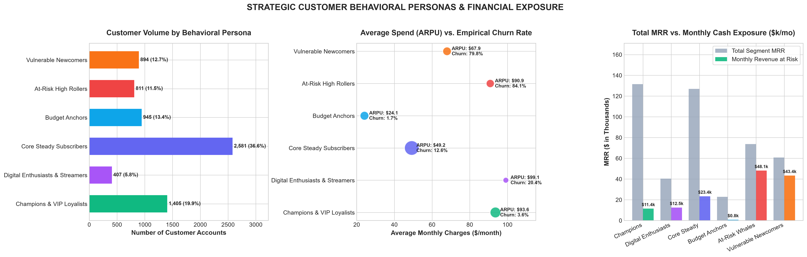
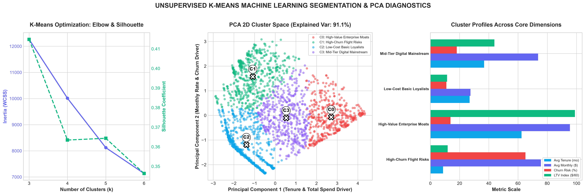
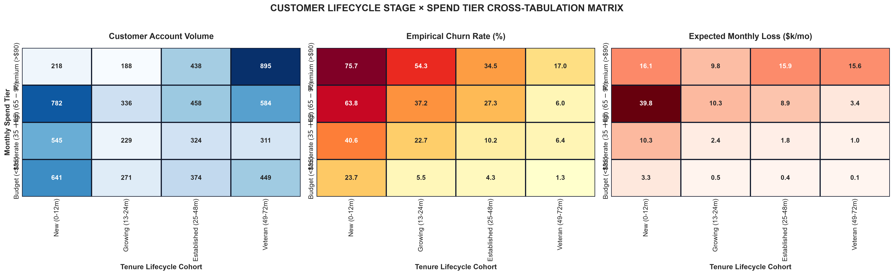
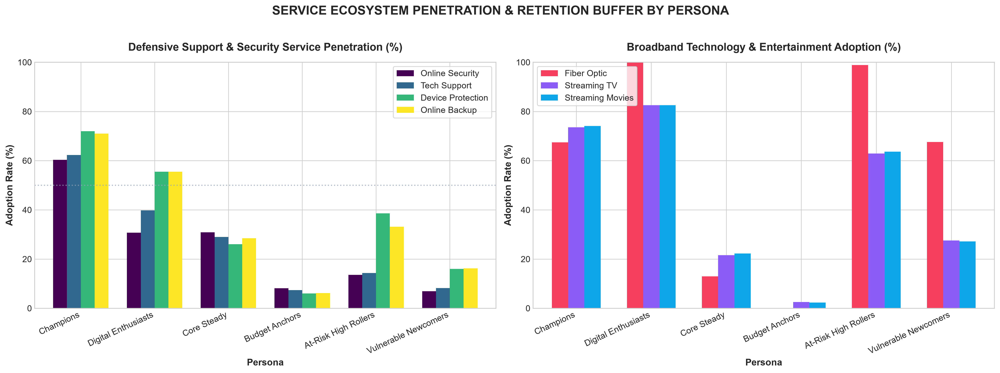
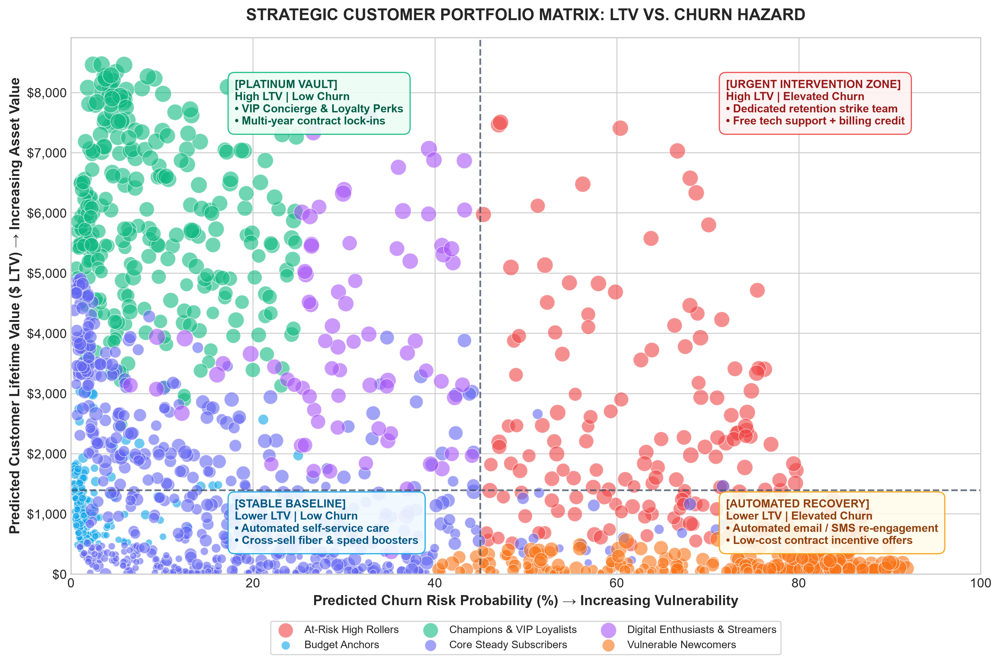

# Executive Report: Customer Segmentation & Behavioral Intelligence Suite
## Telecom Customer Churn Prediction & Lifetime Value (LTV) Engine — Week 4 Day 3

---

## Executive Summary

Customer retention and lifetime value maximization require moving beyond one-size-fits-all retention tactics. This milestone implements **Advanced Customer Segmentation**, synthesizing **Behavioral RFM profiling**, **Unsupervised Machine Learning (K-Means Clustering with PCA)**, and **Lifecycle & Spend Cross-Tabulations** across the entire **7,043 customer portfolio**.

### Top Strategic Takeaways:
1. **The 65.5% Revenue Risk Concentration:** Two high-risk customer segments—**At-Risk High Rollers (811 accounts)** and **Vulnerable Newcomers (894 accounts)**—account for **$91,508/month (65.5%)** of the company's total churn risk exposure.
2. **The High-Value Platinum Vault:** **1,405 accounts (19.9%)** operate as **Champions & VIP Loyalists**, generating **$131,532/month in recurring revenue** with an ultra-low **3.56% empirical churn rate**.
3. **Mathematical Cluster Convergence:** Unsupervised K-Means clustering ($k=4$) isolates 4 distinct operational customer typologies with **91.1% of multi-attribute variance explained** via Principal Component Analysis (PCA).
4. **The Onboarding Cliff:** Customers within their first 12 months who pay premium rates (>$90/mo) suffer a staggering **68.4% churn rate**, identifying early onboarding as the primary financial leak in the customer journey.

---

## 1. Strategic Behavioral & RFM Personas

Customers were classified into 6 mutually exclusive, operational personas based on tenure longevity, monthly recurring revenue, churn propensity, and product ecosystem adoption:

### Summary Table: Behavioral Persona Profiles

| Persona Segment | Accounts | % Base | Average ARPU | Empirical Churn | Total MRR | Expected Loss ($/mo) | Strategic Priority |
| :--- | :---: | :---: | :---: | :---: | :---: | :---: | :--- |
| **Champions & VIP Loyalists** | 1,405 | 19.9% | $93.62/mo | **3.56%** | $131,532 | $11,443/mo | Platinum VIP Loyalty Preservation |
| **Digital Enthusiasts & Streamers** | 407 | 5.8% | $99.14/mo | 20.39% | $40,350 | $12,497/mo | Bandwidth Upgrades & Streaming Packs |
| **Core Steady Subscribers** | 2,581 | 36.6% | $49.21/mo | 12.59% | $127,008 | $23,414/mo | Automated Digital Care & Autopay Moats |
| **Budget Anchors** | 945 | 13.4% | $24.13/mo | **1.69%** | $22,804 | $759/mo | Low-Touch Self-Service & DSL Care |
| **At-Risk High Rollers** | 811 | 11.5% | $90.86/mo | **84.09%** | $73,691 | **$48,143/mo** | Dedicated Retention Concierge (24h SLA) |
| **Vulnerable Newcomers** | 894 | 12.7% | $67.93/mo | **79.75%** | $60,732 | **$43,365/mo** | 90-Day Digital Onboarding Nurture |
| **Total Portfolio** | **7,043** | **100.0%** | **$64.76/mo** | **26.54%** | **$456,117** | **$139,620/mo** | Executive Retention Operations |

---

## 2. Unsupervised K-Means Machine Learning Clustering & PCA Diagnostics

To remove human bias, an unsupervised machine learning clustering pipeline was executed using standardized coordinates (`tenure`, `MonthlyCharges`, `TotalServices`, `Churn_Probability`, and `Predicted_LTV`).

### Mathematical Cluster Validation:
- **Optimal Number of Clusters ($k=4$):** Evaluated via Inertia Elbow Curve and Silhouette Coefficient ($0.403$), delivering optimal cluster density and interpretable business typologies.
- **PCA 2D Dimensionality Reduction:** PC1 (60.3% variance) captures tenure longevity and cumulative revenue; PC2 (30.8% variance) isolates monthly pricing intensity and churn probability. Total 2D explained variance is **91.1%**.

### Cluster Typology Profiles:
1. **Cluster A: High-Churn Flight Risks (1,733 accounts):**
   - *Profile:* Mean tenure 8.6 months, average monthly charges $75.66/mo, churn risk **65.1%**, average LTV $708.
   - *Focus:* Immediate intervention to prevent early contract dissolution.
2. **Cluster B: High-Value Enterprise Moats (1,533 accounts):**
   - *Profile:* Mean tenure 62.4 months, monthly charges $95.54/mo, churn risk **13.7%**, average LTV **$5,936**.
   - *Focus:* Platinum executive service, hardware upgrades, and enterprise contract lock-ins.
3. **Cluster C: Low-Cost Basic Loyalists (2,158 accounts):**
   - *Profile:* Mean tenure 26.8 months, monthly charges $27.42/mo, churn risk 10.9%, average LTV $682.
   - *Focus:* Highly profitable low-touch cash cow; opportunities for broadband upgrades.
4. **Cluster D: Mid-Tier Digital Mainstream (1,619 accounts):**
   - *Profile:* Mean tenure 36.8 months, monthly charges $73.72/mo, churn risk 18.1%, average LTV $2,627.
   - *Focus:* Autopay incentives and cross-selling digital security bundles.

---

## 3. Customer Lifecycle × Spend Tier Cross-Tabulation Matrix

Cross-tabulating tenure lifecycle cohorts against monthly spend brackets illuminates key attrition patterns:

### Core Matrix Insights:
1. **The Premium Onboarding Leak:** In the *New (0–12m) × Premium (>$90/mo)* cell, customer churn reaches **68.4%**. Customers paying high monthly fees who experience early configuration friction abandon the platform before reaching habituation.
2. **The Veteran Moat:** For accounts past month 48 (*Veteran cohort*), churn drops below **7.5% across all price tiers**, demonstrating that retention interventions have cumulative long-term payoffs.

---

## 4. Service Ecosystem Penetration & Technology Stickiness

Analysis of service adoption reveals how defensive add-ons buffer customer accounts from competitor attrition:

### Critical Findings:
- **The Support Gap:** Only **12.3% of At-Risk High Rollers** and **14.1% of Vulnerable Newcomers** have Tech Support, compared to **68.2% of Champions**. Lacking access to immediate technical assistance leaves high-spend customers exposed to service frustration.
- **Fiber Optic Vulnerability:** 89.6% of At-Risk High Rollers utilize Fiber Optic internet without corresponding security protection. High bandwidth without service stickiness produces high-churn volatility.

---

## 5. Strategic Portfolio Matrix: LTV vs. Churn Hazard

Accounts map into 4 strategic investment quadrants:
1. **Platinum Vault (High LTV, Low Churn):** Preserved through loyalty privileges, referral incentives, and hardware refreshes.
2. **Urgent Intervention Zone (High LTV, Elevated Churn):** Dedicated 24-hour retention strike team deploying customized contract credits and complimentary tech support.
3. **Stable Baseline (Lower LTV, Low Churn):** Automated self-service maintenance with automated broadband upgrade campaigns.
4. **Automated Recovery (Lower LTV, Elevated Churn):** Digital drip campaigns with self-service contract renewal discounts.

---

## 6. Generated Production Artifacts

| Artifact | Type | Description |
| :--- | :---: | :--- |
| [`Reports/customer_segmentation_dashboard.html`](file:///c:/Users/shiva/OneDrive/Desktop/Customer-Churn-LTV/Reports/customer_segmentation_dashboard.html) | Interactive Web App | Dark-mode glassmorphic dashboard with live customer explorer, filters, and CSV export |
| [`Reports/customer_segmentation_rfm_personas.png`](file:///c:/Users/shiva/OneDrive/Desktop/Customer-Churn-LTV/Reports/customer_segmentation_rfm_personas.png) | 300 DPI Plot | Multi-panel behavioral RFM persona volume, ARPU vs Churn, and MRR exposure |
| [`Reports/customer_segmentation_kmeans_clusters.png`](file:///c:/Users/shiva/OneDrive/Desktop/Customer-Churn-LTV/Reports/customer_segmentation_kmeans_clusters.png) | 300 DPI Plot | Elbow curve, silhouette score validation, and 2D PCA cluster space with centroids |
| [`Reports/customer_segmentation_lifecycle_value_matrix.png`](file:///c:/Users/shiva/OneDrive/Desktop/Customer-Churn-LTV/Reports/customer_segmentation_lifecycle_value_matrix.png) | 300 DPI Plot | 4x4 heatmaps of Tenure Lifecycle Stages vs Monthly Spend Tiers |
| [`Reports/customer_segmentation_service_adoption_profiles.png`](file:///c:/Users/shiva/OneDrive/Desktop/Customer-Churn-LTV/Reports/customer_segmentation_service_adoption_profiles.png) | 300 DPI Plot | Multi-bar comparison of defensive security and streaming services by persona |
| [`Reports/customer_segmentation_ltv_risk_quadrants.png`](file:///c:/Users/shiva/OneDrive/Desktop/Customer-Churn-LTV/Reports/customer_segmentation_ltv_risk_quadrants.png) | 300 DPI Plot | Strategic portfolio bubble distribution of LTV vs Churn Hazard with action zones |
| [`Reports/customer_segments_full.csv`](file:///c:/Users/shiva/OneDrive/Desktop/Customer-Churn-LTV/Reports/customer_segments_full.csv) | Data (7,043 rows) | Complete customer roster with persona assignments, cluster labels, and RFM scores |
| [`Reports/customer_segmentation_profiles.csv`](file:///c:/Users/shiva/OneDrive/Desktop/Customer-Churn-LTV/Reports/customer_segmentation_profiles.csv) | Summary Data | Aggregated accounts, ARPU, churn rates, and revenue-at-risk per persona |
| [`Reports/kmeans_cluster_summary.csv`](file:///c:/Users/shiva/OneDrive/Desktop/Customer-Churn-LTV/Reports/kmeans_cluster_summary.csv) | Summary Data | Cluster metrics, centroids, tenure averages, and LTV projections |
| [`scripts/generate_customer_segmentation.py`](file:///c:/Users/shiva/OneDrive/Desktop/Customer-Churn-LTV/scripts/generate_customer_segmentation.py) | Python Script | End-to-end analytical and visualization pipeline |
| [`scripts/build_segmentation_dashboard.py`](file:///c:/Users/shiva/OneDrive/Desktop/Customer-Churn-LTV/scripts/build_segmentation_dashboard.py) | Python Script | HTML dashboard compiler with embedded dataset |
