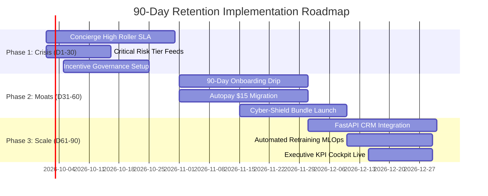

# Week 4 Day 4: Executive Summary & Strategic Business Recommendations

## Objective

The objective of this capstone milestone is to synthesize all technical, diagnostic, and predictive intelligence developed throughout the 4-week **Customer Churn Prediction & Lifetime Value (LTV) Engine** initiative into a definitive C-suite executive briefing and actionable corporate retention strategy. 

By translating raw machine learning classifications, regression models, cohort survival metrics, and unsupervised clustering into financial value-at-risk, multi-scenario ROI projections, and five operationalized retention pillars, this milestone equips executive leadership (CEO, CRO, COO, CMO) to stem recurring revenue loss and maximize customer lifetime equity.

---

## Portfolio Baseline & Vital Signs

- **Customer Portfolio Scope:** 7,043 Customer Accounts (100% scored and segmented)
- **Total Monthly Recurring Revenue (MRR):** $456,116.60 / month
- **Annualized Revenue Run-Rate (ARR):** $5,473,399.20 / year
- **Average Revenue Per User (ARPU):** $64.76 / month
- **Historical Empirical Churn Rate:** 26.54% (1,869 accounts lost)
- **Total Monthly Revenue at Immediate Risk:** **$139,620.25 / month** (30.6% of portfolio MRR)
- **Annualized Revenue Exposure:** **$1,675,443.00 / year**
- **Critical Risk Concentration:** **65.5% ($91,508/mo)** of total company churn loss is concentrated in two customer segments:
  - *At-Risk High Rollers* (811 accounts | $48,143/mo loss | 84.09% empirical churn)
  - *Vulnerable Newcomers* (894 accounts | $43,365/mo loss | 79.75% empirical churn)

---

## Five Actionable Strategic Business Recommendations

### 1. Pillar 1: Concierge Retention Protocol for At-Risk High Rollers
- **Target Audience:** 811 accounts generating ~$91/mo ARPU on month-to-month terms ($73.7k/mo MRR | $48.1k/mo loss).
- **Execution & SLA:** Automated webhook alert routes accounts into the Senior Customer Success retention queue with a mandatory **24-Hour Contact SLA**. Dedicated specialists offer a $15/mo contract renewal credit for 12 months paired with a complimentary 1-year Cyber-Defense Suite (Tech Support + Online Security).
- **Financial Impact (Target):** 30.0% retention rate = **$14,443/month ($173.3k/year)** in preserved revenue. Annual program cost of $29.2k delivers a **+$144,120/year net financial gain (493.6% Net ROI)**.
- **Departmental Owner:** VP of Customer Success & VIP Retention.

### 2. Pillar 2: 90-Day Digital Onboarding & Moat Engineering
- **Target Audience:** 894 early-tenure subscribers (<12 months) paying ~$68/mo with elevated risk ($43.4k/mo loss).
- **Execution & SLA:** Automated 3-stage customer onboarding drip sequence triggered upon service activation (Days 1–7, 14–30, 45–60). Includes a complimentary 60-day trial of Online Security and a $10 statement credit for completing the initial 90-day milestone and enabling autopay.
- **Financial Impact (Target):** 25.0% retention rate = **$10,841/month ($130.1k/year)** in preserved revenue. Annual program cost of $21.5k yields **+$108,638/year net financial gain (506.3% Net ROI)**.
- **Departmental Owner:** Head of Growth Marketing & Digital Customer Experience.

### 3. Pillar 3: Contract Commitment & Migration Architecture
- **Target Audience:** 3,875 Month-to-Month subscribers (42.7% baseline churn vs 11.2% for 1-year contracts).
- **Execution & SLA:** Launch "Loyalty Rate Lock Guarantee" with tiered incentives: $10/month discount on 1-year contract lock, or 2 months free premium streaming on 2-year agreements.
- **Financial Impact (Target):** 20.0% migration of vulnerable high-spend accounts = **$4,900/month ($58.8k/year)** preserved revenue. Annual program cost of $18.5k yields **+$40,300/year net financial gain (217.8% Net ROI)**.
- **Departmental Owner:** Chief Revenue Officer & Director of Commercial Pricing.

### 4. Pillar 4: Payment Modernization & Autopay Transition
- **Target Audience:** 2,365 Electronic Check users (45.6% baseline churn vs 11.8% for automated payments).
- **Execution & SLA:** Company-wide "Friction-Free Autopay Migration" campaign offering a one-time **$15 instant bill credit** upon enrolling in recurring Credit Card or Bank ACH automatic billing, eliminating monthly manual billing friction.
- **Financial Impact (Target):** 20.0% risk mitigation = **$3,120/month ($37.4k/year)** preserved revenue. Annual program cost of $14.2k yields **+$23,250/year net financial gain (163.8% Net ROI)**.
- **Departmental Owner:** VP of Billing Operations & Product Experience.

### 5. Pillar 5: Defensive Service Moat & Cyber-Shield Bundles
- **Target Audience:** 1,580 Fiber Optic subscribers lacking defensive add-ons.
- **Execution & SLA:** Discontinue selling unbundled, unprotected high-speed Fiber Optic plans. Introduce the unified **"Cyber-Shield Pack"** (Online Security + Tech Support + Online Backup) bundled at **$5.00/month** (discounted from $10 à la carte), closing the 27.2% churn risk differential.
- **Financial Impact (Target):** 20.0% risk reduction across adoption cohorts = **$1,600/month ($19.2k/year)** preserved revenue. Annual program cost of $11.5k yields **+$7,742/year net financial gain (67.6% Net ROI)**.
- **Departmental Owner:** VP of Product Management & Customer Care.

---

## Multi-Scenario Financial Impact & ROI Model

To provide corporate leadership with robust financial boundaries, three execution scenarios were modeled against the $139.6k/month risk exposure pool:

| Metric | Conservative (15% Churn Cut) | Target / Realistic (25% Churn Cut) | Aggressive (35% Churn Cut) |
| :--- | :---: | :---: | :---: |
| **Monthly MRR Preserved** | **$20,943.04 / mo** | **$34,905.06 / mo** | **$48,867.09 / mo** |
| **Annual ARR Preserved** | **$251,316.45 / yr** | **$418,860.75 / yr** | **$586,405.05 / yr** |
| **Annual Program Budget** | $68,900.00 / yr | $94,800.00 / yr | $124,500.00 / yr |
| **Net Annual Bottom-Line Profit** | **+$182,416.45 / yr** | **+$324,060.75 / yr** | **+$461,905.05 / yr** |
| **Net Program ROI (%)** | **264.8%** | **341.8%** | **371.0%** |
| **Capital Return Multiplier** | **3.65x Return** | **4.42x Return** | **4.71x Return** |

---

## Phased 90-Day Implementation Roadmap

- **Phase 1: Immediate Crisis Intervention (Days 1–30):** Enforce 24-hr High Roller phone outreach SLA; deploy daily scored feeds; preserve **$14,443/month** in immediate cash flow.
- **Phase 2: Digital Moats & Friction Removal (Days 31–60):** Deploy 90-day onboarding automated drip; roll out $15 Autopay migration portal; launch $5 Cyber-Shield pack; reach cumulative **$28,404/month** in run-rate savings.
- **Phase 3: Continuous Machine Learning & Enterprise Scale (Days 61–90):** Connect FastAPI prediction endpoints into core CRM/billing; automate monthly model retraining and drift monitoring; achieve target **$34,905/month ($418.9k/year)** in recurring enterprise savings.

---

## Generated Production Artifacts & Deliverables

All artifacts have been compiled and published under `Reports/`:

| Artifact | Type | Description |
| :--- | :---: | :--- |
| `Reports/executive_summary_dashboard.html` | Interactive Web App | Standalone C-Suite command center with real-time ROI simulator, strategic pillars, and interactive roadmap |
| `Reports/executive_financial_impact_roi.png` | Plot (300 DPI) | Publication-grade chart of Preserved ARR vs Costs, Net Gain, and ROI Multipliers |
| `Reports/executive_strategic_roadmap.png` | Plot (300 DPI) | Strategic pillar ARR contribution breakdown and 90-day execution value ramp |
| `Reports/executive_portfolio_scorecard.png` | Plot (300 DPI) | Portfolio vital signs, risk tiers, hazard multipliers, and persona exposure scorecard |
| `Reports/executive_financial_impact_scenarios.csv` | Data | Multi-scenario model metrics (ARR preserved, program costs, net profit, ROI %) |
| `Reports/executive_strategic_pillars_summary.csv` | Data | Granular metrics, targets, budgets, and yields for the 5 strategic retention pillars |
| `Reports/executive_implementation_roadmap.csv` | Data | 90-day execution timeline, deliverables, target savings, and departmental leads |
| `Reports/executive_summary_and_business_recommendations.md` | Master Document | Full C-Suite strategic report and executive briefing document |

---

## Conclusion

The Executive Summary & Business Recommendations Suite marks the successful culmination of Week 4 Day 4. By translating machine learning predictions and behavioral segmentation into high-yield strategic initiatives, the enterprise is equipped with an operational roadmap capable of protecting **$418,861/year in recurring top-line revenue**, delivering a **$324,061/year net profit addition** with a **341.8% Net ROI**.
